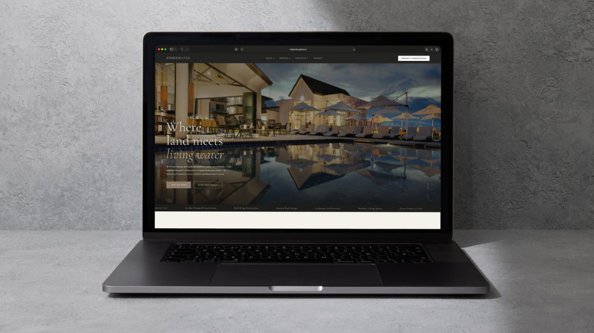

# Stonewater — Luxury Outdoor Living Brand Concept

**A spec brand and website concept for the Fairfield County luxury landscape & pool category.**  
Designed and developed by Michael Hnath — Brand & Growth Strategist.

🔗 **[Live demo →](https://mikehnath.github.io/stonewater/)**

---

## The Brief

Fairfield County's luxury home services market — pool builders, landscape architects, outdoor living contractors — is dominated by firms that do exceptional physical work but present themselves with weak, contractor-grade digital experiences. The category charges $50K–$500K per project and caters to one of the most affluent demographics in the country, yet most brands in the space undersell themselves online.

Stonewater is a concept brand built to answer a single question:

> What would a luxury outdoor living brand look like if it were designed with the same rigor as the work it delivers?

---

## Strategic Positioning

| | |
|---|---|
| **Category** | Luxury landscape architecture, pool design & build, estate property care |
| **Geography** | Fairfield County, CT + Westchester County, NY |
| **Audience** | Discerning homeowners investing $100K+ in their outdoor environment |
| **Voice** | Editorial, confident, design-led — not contractor-led |
| **Positioning statement** | *Where land meets living water.* |

The brand is built around a **design-led, not contractor-led** point of view — a deliberate contrast to how most firms in the category sell themselves. Every visual and copy decision reinforces that positioning.

---

## Design System

- **Typography** — Cormorant Garamond (editorial serif) paired with Jost (geometric sans-serif)
- **Palette** — Deep charcoal, warm stone tones, water blue, generous negative space
- **Architecture** — Full single-page application with seven routed sections: Home, Portfolio, Portfolio Detail, Services, About, Contact
- **Motion** — Scroll-reveal animations, fixed-nav scroll behavior, parallax testimonial, subtle horizontal service ticker

---

## What's Built

A complete multi-page marketing site with:

- Full navigation architecture mirroring how a real luxury services site is organized
- Homepage with hero, philosophy, services grid, differentiators, portfolio preview, process, testimonial, and consultation CTA
- Portfolio index with category filtering
- Individual project detail pages with project specs, gallery, and prev/next navigation
- Service detail page demonstrating deep-link merchandising of a single offering
- About page with brand story, team, and milestone timeline
- Contact page with service-specific inquiry routing

---

## Tech Stack

Intentionally lightweight — the point was design and content, not framework overhead.

- Vanilla HTML / CSS / JavaScript
- Client-side routing (no build step)
- IntersectionObserver for scroll animations
- Hosted on GitHub Pages
- Imagery sourced from Unsplash for the concept; replaceable with client photography in production

---

## File Structure

stonewater/
├── index.html      # Structure and routed section markup
├── style.css       # Full design system and responsive layout
├── main.js         # Routing, scroll behavior, filters, reveal animations
└── images.md       # Image source reference

---

## About the Work

This is one of several spec concepts I've developed to demonstrate what's possible when a premium services category is approached with the same craft the work itself demands. My background spans 15+ years across CPG (Kraft Heinz), licensed consumer brands (Infinity Global — Disney, MLB, Nickelodeon), healthcare marketing (POCN), and independent brand and growth consulting.

**Interested in a similar concept for your brand?**  
→ [linkedin.com/in/michaelhnath](https://linkedin.com/in/michaelhnath)

---

## License

Concept design © 2026 Michael Hnath. Imagery via Unsplash under their license. Brand name, positioning, and content are fictional and for demonstration purposes only.
